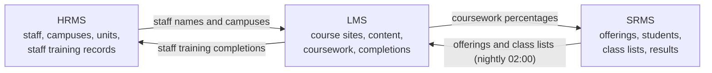
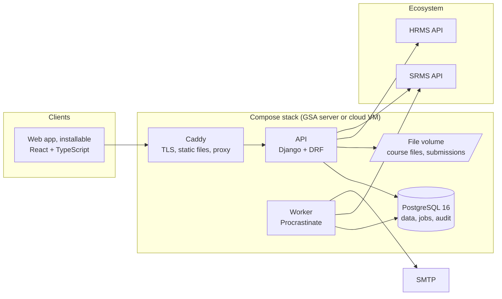

# Architecture

The LMS is one of the three systems of the GSA ecosystem (HRMS, SRMS, LMS). Each has its own repository,
database and deployment, and runs on its own; they work as one through three rules from the GSA Ecosystem
Architecture document: one owner per fact, shared codes rather than shared tables, and scoped service keys.

## Where the LMS sits

| The LMS owns | The LMS holds by reference |
|---|---|
| Course sites, memberships, modules and content, announcements, assignments, submissions, coursework marks, completions | Staff (employee number, from the HRMS), students, offerings and class lists (student number and offering code, from the SRMS), campuses (codes the HRMS owns) |

The LMS owns no person and no result. A course site is created for each SRMS offering; its lecturer and
students arrive with the class list. A student who drops the course in the SRMS is deactivated in the site,
never deleted, so their submissions stay on record. The lecturer teaches and marks in the LMS, which computes
each student's weighted coursework percentage and sends it to the SRMS. The SRMS adds the examination mark,
and the Registrar publishes. Completions of staff-development sites go to the HRMS training record.

| Flow | Endpoint | Scope | Direction |
|---|---|---|---|
| Staff names and campuses | HRMS `GET /integration/staff/`, `/integration/org/` | `staff:read`, `org:read` | LMS pulls |
| Offerings and class lists | SRMS `GET /integration/offerings/`, `/integration/enrolments/` | `academics:read` | LMS pulls (nightly, `integration.tasks.sync_srms`) |
| Coursework percentages | SRMS `POST /integration/coursework-marks/` | `marks:write` | LMS pushes (`sync_ecosystem --push-marks`) |
| Attendance totals (decision D6, [ADR 0008](adr/0008-attendance-in-the-lms.md)); only for courses whose programme makes attendance a condition | SRMS `POST /integration/attendance-totals/` (SRMS work, not built yet) | to be agreed with the SRMS | LMS pushes (teaching staff, `POST /api/v1/attendance/sites/{id}/send-to-srms/`) |
| Training completions | HRMS `POST /integration/training-completions/` | `training:write` | LMS pushes (`sync_ecosystem --push-training`) |
| Course sites | LMS `GET /api/v1/integration/sites/` | `sites:read` | Sibling systems pull |

No integration endpoint carries NIS number, TIN, national ID, date of birth or address.

## Inside the LMS

| Layer | Location | Responsibility |
|---|---|---|
| Presentation | `web/` | My courses, the course site (content, assignments, gradebook, announcements), notifications; talks only to `/api/v1`; installable, phone first |
| API | `api/` Django apps | Sign-in and authenticator codes, access by site membership, validation, the coursework rule, OpenAPI schema |
| Jobs | Procrastinate tasks | The nightly sync of sites and class lists; notifications |
| Data | PostgreSQL via Django migrations | Every table carries its time stamps and the users who created and changed it; the audit log is insert-only |
| Edge | `deploy/` | TLS, compression, security headers, the built web app |

Apps and their models (`api/`):

| App | Models | What it does |
|---|---|---|
| `people` | PersonRef | A person known by employee number (staff) or student number, linked to an account |
| `courses` | CourseSite, Membership, Module, ContentItem, Announcement, Completion | Sites (academic from the SRMS, or local, including staff development), who is in them and in what role, content, announcements, completions |
| `courses` (group work, `courses/groups.py`) | Grouping, GroupSignUp | Groupings of a site's groups, random allocation into N groups or groups of K, self-sign-up with a size limit and closing time (item 4.12) |
| `forums` | Forum, Thread, Post, Subscription, PostReport, ConductStatement, ConductAcceptance, ParticipationMark | Forums per site or module (general, question-and-answer, graded), threads and replies, subscriptions, moderation and reports, the conduct statement, participation marks counted in coursework (items 4.08 to 4.10) |
| `messaging` | Conversation, Participant, Message | A student and the teaching staff; staff to a group or the whole site; read receipts; offline queue (item 4.11) |
| `attendance` | ClassSession, AttendanceRecord, AttendancePolicy | Class sessions with meeting and recording links, the register (phone, offline), check-in by rotating code, totals sent to the SRMS (items 4.14, 4.15) |
| `calendars` | CalendarFeed | One calendar of due dates, classes and release dates per person, and a private iCalendar feed (item 2.32) |
| `assessments` | Assignment, Submission, Mark | Assignments with weights and dates, submissions (late flag), marks with release control, the gradebook and coursework percentage |
| `integration` | ServiceClient, CampusRef | Service keys (hashed, scoped, rotatable), campus codes, the HRMS and SRMS clients and the sync |
| `iam` | Role, RoleScope, TotpDevice, LoginAttempt | System roles, authenticator codes, lockout |
| `audit` | AuditLog | Insert-only record of every change and every download |
| `notifications` | Notification | In-app notices (announcements, released marks), also sent by email |
| `core` | TimeStampedModel, PublicHoliday | Shared base classes, field encryption, seed commands |

`core`, `iam`, `audit` and `notifications` are the skeleton shared with the HRMS and the SRMS. The HRMS
versions are the hardened ones; fixes are ported from there (checklist Phase 1).

## Request flow: a coursework total

1. Overnight, `sync_srms` pulls the offerings and class lists: one course site per offering, the lecturer
   as teacher, the enrolled students as members.
2. The lecturer adds content and assignments (`/api/v1/modules/`, `/content/`, `/assignments/`); each write
   records an audit row in the same transaction. Students see published material only.
3. A student submits (`POST /api/v1/assignments/{id}/submit/`): late work is flagged, or refused when the
   assignment does not allow it; a marked submission cannot be replaced.
4. The lecturer marks (`POST /api/v1/submissions/{id}/mark/`) and releases; the student is notified.
5. The gradebook applies the coursework rule: a marked assignment counts with its mark, an overdue one with
   no submission counts as zero, a submitted but unmarked one is pending and does not count; the total is
   weighted by each assignment's weight.
6. `sync_ecosystem --push-marks` sends each student's percentage to the SRMS, which accepts it only on a
   draft result.

## Security

TLS at Caddy; session cookies for the web app; an authenticator code (TOTP) for administrators and course
administrators, and for lecturers once item 1.11 is built ([ADR 0013](adr/0013-lecturer-authenticator-code.md));
lockout after repeated failures; access to a site decided by membership of it, in one place
(`courses/access.py`); identifiers encrypted with `FIELD_ENCRYPTION_KEY`; course files and submissions served
only through authenticated, audited downloads; insert-only audit log protected by a database trigger. The
debts the HRMS has already paid (admin sign-in, forged addresses, upload checks, Content-Security-Policy and
others) are Phase 1 of the checklist.

## Decisions

The decision records are in [adr/README.md](adr/README.md).
