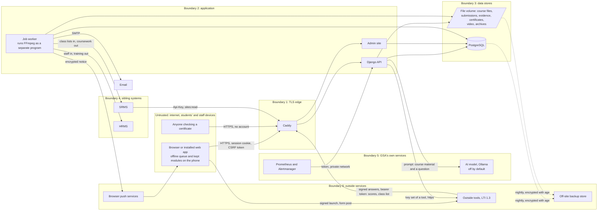

# Threat model

**Version 1.2, 6 October 2026,** checklist item 0.21. Method: STRIDE (spoofing, tampering, repudiation,
information disclosure, denial of service, elevation of privilege) over the data flows in section 3,
against the code on branch `feature/finish-operations` (base `dd12db6`, with `main` merged in at `57405ee`).
It follows the structure of the HRMS threat model (`HRMS/gsa-hrms/docs/security/threat-model.md`, version
1.22), whose fixes the LMS skeleton has ported (checklist Phase 1). The review against OWASP ASVS Level 2
([asvs-l2.md](asvs-l2.md), item 7.01) checks the same code requirement by requirement; this document says
what could go wrong and what stops it.

Version 1.1 adds what the merge of `main` brought (outside tools over LTI 1.3, AI assistance, lecture video
prepared with FFmpeg, push notices) in section 4a, and the operations controls built since version 1.0
(monitoring, backups, the closed-site guard, the permission table) in section 4b; it also marks the fixes
of the ASVS review that are done. Reviewed at every release gate and whenever a data flow, role or
integration is added. Gaps point to items in the Gold Standard Implementation Checklist, or to a fix
numbered in the ASVS review, version 1.1 ("ASVS fix 3"). Version 1.2 records the hardening on branch
`feature/finish-hardening` (ASVS review version 1.2): the fixes it closes are marked **Fixed (1.2)** below.

## 1. What is protected

| Asset | Examples | Classification | Where it lives and how |
|---|---|---|---|
| Learner records | Names, student numbers, email, campus, course memberships, from the SRMS | Personal; some learners are under 18 | PostgreSQL; read by the course's teaching staff and course administrators only (`courses/access.py`) |
| Submissions | Files and text students hand in, with the time and the late flag | Personal; decides progression | File volume under random names (`core/uploads.py`); each hand-in kept with a receipt and a SHA-256 of its contents (`assessments/models.py`) |
| Marks and feedback | Marks, rubric scores, comments, spoken feedback, released or not; scores posted by outside tools | Personal; become results in the SRMS | PostgreSQL and file volume; unreleased marks hidden from the student; locked once the SRMS accepts the total |
| Quiz attempts | Answers, marks, the events of each attempt; the question banks and right answers | Personal (attempts); integrity-critical (banks) | PostgreSQL; right answers never sent to a student during an attempt (`quizzes/schemas.py` `public_data`) |
| Practical evidence | Observations, logbook entries, photographs and scans, and a location when the person taps "Add my location" | Personal; photographs may show people and carry the phone's location inside the file | PostgreSQL and file volume (`practicals/`) |
| Accommodations and extensions | Extra time, extra days, another format, and why | Sensitive: the reason may describe a disability or illness (health data) | PostgreSQL; an accommodation's reason encrypted and seen only by course administrators (`assessments/models.py`), masked in the audit log |
| Attendance | Class sessions, the register, check-in times | Personal | PostgreSQL (`attendance/`) |
| Conversation | Forum posts and reports, private messages and read receipts, help requests | Personal; may involve minors | PostgreSQL (`forums/`, `messaging/`, `helpdesk/`) |
| Lecture video and captions | Recordings that may show or be heard by students; their copies, poster frames and captions | Personal where people appear | File volume (`video/`); never sent to an outside service (ADR 0015) |
| Certificates | Certificates of completion, their reference, check code and fingerprint, and the log of checks | Integrity-critical; personal | PDF on the file volume; check code encrypted (`certificates/models.py`) |
| Outside tools' data | Each tool's registration and key, the identifier each tool knows a person by, launches, line items and scores; the LMS's own signing key | Personal (scores, identifiers); secret (the key) | PostgreSQL (`lti/models.py`); the LMS's private key encrypted with the application key |
| AI assistance records | When the model was asked, by whom, on which course, which pages were used; a lecturer's drafts | Personal (activity) | PostgreSQL (`assist/models.py` `Exchange`); never a student's question or the answer; removed after 12 months (rule `ai-exchanges`) |
| Push subscriptions | The browser's push address and keys for each device that turned push on | Personal; secret (the keys) | PostgreSQL; the keys encrypted (`notifications/models.py`) |
| Audit log | Who did what, when, from where, before and after | Integrity-critical | Insert-only table; a database trigger refuses UPDATE and DELETE; every entry chained to the one before by a keyed fingerprint, checked every night (`audit/chain.py`) |
| Credentials | Passwords, authenticator secrets, service keys, tools' tokens, session cookies, password links, calendar feed addresses | Secret | PBKDF2-SHA256 with 1,000,000 iterations; authenticator secrets and feed tokens encrypted; service keys and tools' tokens stored as SHA-256; password links signed over the password and the last sign-in, so each works once, for 7 days (invitation) or 60 minutes (reset) |
| Server secrets | `DJANGO_SECRET_KEY`, `FIELD_ENCRYPTION_KEY`, database and SMTP passwords, HRMS and SRMS keys, `METRICS_TOKEN`, `VAPID_PRIVATE_KEY` | Secret | Environment only (git-ignored `.env`, platform variables); who holds each and how it is changed: `docs/runbook.md`, "Keys" |
| Backups | Encrypted copies of the database and the file store | As their content | Encrypted with `age` before they touch the disk; private keys kept off the server by two named holders; copied off site; 14 daily, 8 weekly, 12 monthly (`scripts/backup.sh`) |
| Logs and metrics | Request lines (route, status, time, account id), errors with their traces, counts | Personal (account ids, addresses in errors) | Standard output, kept by Docker on the server; metrics in Prometheus for 30 days (`deploy/monitoring/`) |
| Site archives | The read-only export of a course site once its term is archived: its records and files | As their content | Zip files on the file volume (`terms/lifecycle.py`); downloads audited |

## 2. Who uses it, and who might attack it

| Actor | Access |
|---|---|
| Student | Their own courses (published sites only), their own work, released marks, their own attempts, forums and messages to teaching staff; the study helper where a course switches it on; often on a shared or borrowed phone over mobile data. Some are under 18 |
| Lecturer and teaching assistant | The sites they teach: content, assignments, every student's work and marks there, the register, practical observations, placing outside tools, lecture video, AI drafts; authenticator code required (`iam/services.py` `requires_mfa`, ADR 0013) |
| Course administrator | Every site, including closed ones for appeals; accommodations and their reasons; correction requests; the term calendar; registering outside tools and what they may know; authenticator code required |
| Administrator | Everything, including the admin site, the retention schedule and the breach register; authenticator code required |
| Auditor | Read-only on every site, the library, course insights and the audit log; authenticator code required (version 1.2) |
| Data Protection Officer | The privacy notice, people's whole records for requests on paper, the breach register; authenticator code required (version 1.2) |
| SRMS and HRMS | Service keys with scope `sites:read` into the LMS; the LMS holds keys to their `academics:read`, `marks:write`, `attendance:write`, `staff:read`, `org:read`, `training:write`, `training:read` scopes |
| Outside tools (LTI) | Registered by a course administrator; receive signed launches for the people who open them, may post scores to their own gradebook columns and, if allowed, read class lists; run by third parties, possibly abroad |
| The AI model | An Ollama server GSA runs, at `AI_OLLAMA_URL`; receives prompts made of course material and a question; off by default |
| Browser push services | Google, Mozilla, Apple and Microsoft relay push notices to devices; they see an encrypted payload, its timing and the device's address |
| Monitoring | Prometheus reads `/api/metrics` with `METRICS_TOKEN` on the private network; Alertmanager sends email |
| Someone with no account | The sign-in and password pages, and the public certificate check |
| Operators | Shell and database access on the host (Railway for staging now, GSA's chosen host later); hold the keys of `docs/runbook.md` |

Threat sources: an attacker on the internet; a student wanting a better mark or a friend's answers; a
current or former member of staff misusing access; a lost or shared phone; a compromised dependency; a
compromised sibling system or outside tool; a hostile file put up to attack the converters.

## 3. Data flows and trust boundaries

Certificates are rendered inside the API by the PDF engine from escaped text only; the engine is given a
fetcher that refuses every address (`certificates/pdf.py` `_refuse`). Quiz questions imported from Moodle
XML, GIFT or QTI files are parsed inside the API with document types and entities refused
(`quizzes/formats.py` `refuse_unsafe_xml`). A lecture video is read and converted by FFmpeg, built without
network or device support (`api/Dockerfile`), run by the job worker as a separate program
(`video/convert.py`). Automatic captions, when GSA switches them on, run whisper.cpp on the same server
(`video/transcribe.py`). There is still no packaged-content (SCORM or H5P) player: ADR 0014 leaves it open,
and it needs a section here before it is built.

## 4. Threats and controls

### Spoofing

| Threat | In place | Residual risk and gap |
|---|---|---|
| Guessing a password at sign-in | Lockout after 5 failures in 15 minutes per account; one address that fails 20 times in 15 minutes, across any accounts, waits out the window (`iam/services.py` `account_locked`, `address_blocked`; tests `iam/tests.py::test_account_locks_after_repeated_failures`, `::test_one_address_failing_across_many_accounts_is_held_back`); 12-character minimum and the common-password check; failures and lockouts in the chained audit log (`iam/views.py` `login_view`) | Low |
| Guessing the authenticator code once the password is known | Codes asked of administrators, course administrators and anyone teaching a site (`requires_mfa`); a wrong code counts as a failed sign-in, and at the limit the session ends and the account waits; each code is accepted once (`iam/views.py` `mfa_verify`, `TotpDevice.last_used_step`; tests `iam/test_asvs.py`) | Low. The person is not told when a used code is offered again (ASVS fix 10) |
| A password alone opening everyone's records | | **Fixed (1.2):** the auditor and the Data Protection Officer, who read every site and the audit log and can produce anyone's whole record, now verify an authenticator code like the other administrative roles (`iam/models.py` `Role.MFA_REQUIRED`; test `iam/tests.py::test_the_auditor_and_the_data_protection_officer_must_verify_a_code`). Low |
| Enrolling one's own authenticator on someone else's account | The first code confirms the device; after that enrolment is refused (`mfa_enrol`); setting one up tells the owner by notification and email | Someone who has the password before the owner first signs in could enrol first; the invitation goes only to the owner's address. Removing a device in the admin site is audited (`iam/admin.py`) but does not end the person's sessions (ASVS fix 10); the identity check is written in `docs/runbook.md` for GSA to approve |
| The admin site as a side door | No password form of its own; it accepts only a web sign-in that has passed the authenticator step (`iam/admin_site.py`; test `iam/tests.py::test_admin_needs_the_verified_web_sign_in`) | Low |
| Stolen session cookie | HttpOnly; Secure in production; SameSite Lax; HSTS for one year; a session ends after 30 minutes idle or 8 hours in all (`iam/middleware.py`); people see every device they are signed in on and can end any (`iam/views.py` `sessions_view`) | Low. Cookie names without the `__Host-` prefix (ASVS fix 11) |
| Shared phone in a lab or on the farm | Sign-out on every screen; 30-minute idle time-out; the offline queue sends a write only while its owner is signed in (`web/src/app/offlineQueue.ts`); the field copy of a class list is cleared on sign-out and on a time-out (`web/src/App.tsx`); API answers are never kept by the browser (`Cache-Control: no-store`, `config/observability.py`) | Modules kept for offline reading stay on the phone after a time-out, served only to their owner (ASVS fix 10) |
| Taking over an account through "forgot password" | Same answer whether or not an account exists; the link goes only to the address on the account, works once, for 60 minutes; 5 requests per address and 3 links per account in 15 minutes; choosing a password ends every session and tells the person (`forgot_password_view`, `set_password_view`) | Low |
| Redirecting the links | The sign-in email changes only when a link sent to the new address is followed within 48 hours; the old address is told (`iam/email_change.py`) | Someone holding both the password and the new mailbox can still change it; the notice to the old address is how the person finds out |
| Someone else checking in to a class (attendance) | The code in the room is an HMAC of the class and the time, valid for 60 seconds; the short code is valid for its minute and the next; one check-in per student per class; check-in open only from 15 minutes before to the end (`attendance/codes.py`, `attendance/api.py` `_check_in_open`) | **Medium:** a student in the room can send the code to a friend who is not, who has a minute to use it. The LMS does not ask for location (ADR 0008 keeps attendance light). The lecturer's register can correct a check-in; a lecturer who suspects it shows a fresh code and counts heads |
| Stolen service key | Hashed at rest, scoped, rotatable, last use recorded (`integration/models.py` `ServiceClient`); calls come over the private network; the LMS follows a sibling's `next` page only on its own host (`integration/client.py` `pages`); how and when to change keys is in `docs/runbook.md`, "Keys" | The sibling client follows HTTP redirects, and Python's `urllib` sends the key on to the new host (ASVS fix 6) |
| Calendar feed address passed on | The address is a 256-bit secret, encrypted at rest; it shows due dates and classes only; a new one stops the old at once; 30 reads an hour per address and 120 per network address (`calendars/api.py`) | Anyone given the address reads that person's timetable until it is changed |
| Reading the metrics from outside | `/api/metrics` answers only with `METRICS_TOKEN`, compared in constant time, and is not found when no token is set; Caddy refuses it from outside (`config/observability.py` `metrics`; `deploy/Caddyfile.prod`); Prometheus is not published | Low. The metrics carry counts by route and error group, no personal data |

### Tampering

| Threat | In place | Residual risk and gap |
|---|---|---|
| Handing in or changing work after the due date | The server's clock decides lateness, never the phone's; late work is refused when the assignment does not allow it; work cannot be replaced after the due date, or at all once marked (`assessments/api.py` `submit`); each hand-in is kept with a receipt and a SHA-256 of its contents, sent to the student as a notice at once (`_send_receipt`); a closed site refuses every change except a course administrator's or an administrator's, for an appeal, audited (`terms/guard.py`; tests `terms/tests.py`) | Low |
| A quiz answer saved after time is up | The deadline is the server's; an answer that arrives after it (plus a short grace) is refused and the attempt submitted (`quizzes/services.py` `save_answer`, `is_expired`); the attempt row is locked while an answer is written; test `quizzes/tests/test_api.py::test_time_limit_is_enforced_on_the_server` | Low. The phone's clock only orders two answers from the same device |
| A queued offline write replayed or altered | Each write carries an Idempotency-Key kept per account; the same key with a different body is refused; the phone's time is refused when more than 7 days old or 10 minutes ahead (`practicals/offline.py`); a write needs the owner's session and CSRF token | Low. Someone holding the phone and the owner's session could send a register entry with an earlier time within 7 days; the lecturer's register is the check |
| Changing a mark without trace | Every mark and release made in the web app is audited in the same transaction; marks lock once the SRMS accepts the total (`assessments/models.py` `SrmsTransfer`) | **Fixed (1.2):** every change made in the Django admin site is in the chained audit log, whichever model, Django's accounts included (`iam/admin_audit.py`; tests `iam/test_admin_audit.py`); marks and handed-in work are read-only there. Low |
| A forged or altered certificate | Each certificate has a reference, a random 12-character check code (60 bits, encrypted at rest) and the SHA-256 of the PDF as issued. Anyone can check it on a public page by reference and code; a wrong code and an unknown reference get the same answer; 10 wrong codes from one address or for one reference in 15 minutes stop checks; 30 checks a minute per address; the holder is told when it is checked; a withdrawn certificate says so (`certificates/checking.py`, `certificates/api.py` `check_page`) | Low. Anyone holding a copy can read its details on the page, which they could from the copy |
| Destroying records to hide something | Records are destroyed only under the retention schedule, in a run one person lists and a second approves; each destruction is audited with its rule (`privacy/retention.py`); archiving a term destroys nothing (`terms/lifecycle.py`) | Low |
| Changing or removing audit entries | Insert-only with a trigger; every entry carries an HMAC-SHA256 of the one before and its own content, under a key derived from `FIELD_ENCRYPTION_KEY`, which is never in the database; checked every night and on request; a broken chain alerts administrators and the auditor in the LMS and through the monitoring (`audit/chain.py`; `deploy/monitoring/alerts.yml` `LmsAuditChainBroken`; tests `audit/test_chain.py`); a restore is refused unless the chain checks (`scripts/restore.sh`) | Someone with the database and the server key could rewrite the chain: the key is not in the backups, and the backups' private keys are not on the server (`docs/runbook.md`). The application connects as the database superuser, which can switch the trigger off (ASVS fix 2). After a change of `FIELD_ENCRYPTION_KEY` the chain still verifies: the old key is kept in `AUDIT_CHAIN_RETIRED_KEYS` for that only, and keys only get newer along the chain, so a retired key cannot seal later entries (`audit/chain.py` `walk`; tests `core/test_key_rotation.py`) |
| Cross-site request forgery | Django CSRF protection on every session write; the web client sends the token (`web/src/api/client.ts`); the LTI addresses tools call take a signed token or a bearer token instead of a cookie | Low |
| Harmful uploads | Every upload is checked by its contents, not its name (PDF, photographs, Word, Excel or PowerPoint without macros, audio for feedback, video by its container header and then FFprobe); limits of 50, 20 and 15 MB, and 1024 MB for a video; Caddy refuses any request over 60 MB except at the video address (1100 MB); random stored names; downloads are attachments with `nosniff`, never a public address (`core/uploads.py`, `video/api.py`; tests `core/test_uploads.py`) | **Medium:** no virus scan (ASVS fix 15). A PDF or Office file that is malicious but well formed reaches the lecturer's computer |
| Script in rich pages, forum posts, messages or quiz text | Cleaned on the server against an allow-list with nh3: no script, no event handlers, links to web and email addresses only, images only from the LMS (`courses/richtext.py` `clean`); maths drawn by KaTeX with `trust: false`; a message waiting to send shown as plain text (`MessagesScreen.tsx`); a Content-Security-Policy that allows only the app's own scripts, checked on every browser journey (`deploy/Caddyfile.prod`; `web/e2e/support.ts`) | Low. The API documentation page (signed-in people only) loads Swagger UI from a public CDN at "latest" (ASVS fix 4) |
| Hostile quiz import files | Document types and entities refused before parsing; 5 MB per file, a limit on files and unpacked size in a package (`quizzes/formats.py`) | Low |
| Tampered dependencies | Python packages locked with hashes; npm lockfile; CI actions pinned to commits; licence, vulnerability and secret gates; bills of materials for what ships on every run and each release (`.github/workflows/ci.yml` job `sbom`) | Base images follow tags (ASVS fix 23) |
| Coursework sent to the SRMS changed on the way | Sent with the LMS's scoped key; the SRMS accepts it only on a draft result | Plain HTTP on the private network until hosting decides otherwise (item 7.04) |
| Restoring a backup someone changed | Each backup carries SHA-256 fingerprints and is encrypted with `age`, which detects any change; the restore checks the fingerprints, the audit chain, and the rows and files against the manifest before the stack starts (`scripts/restore.sh`) | Low |

### Repudiation

| Threat | In place | Residual risk and gap |
|---|---|---|
| A student says they handed work in on time | The receipt code, the server time and the content fingerprint, sent to the student as a notice at once and kept for good (`assessments/marking_api.py` receipt look-up) | Low |
| A lecturer denies a mark, a release or a change of content | Audit rows with actor, time, address, before and after, read in words by the auditor (`audit/views.py`) | Low, in the web app and the admin site alike (version 1.2) |
| An administrator denies giving a role | Giving, changing and taking a role, and removing an authenticator, in the admin site are in the chained audit log (`iam/admin.py` `AuditedAdmin`; test `iam/test_asvs.py::test_roles_and_authenticators_changed_in_the_django_admin_are_audited`) | No reason is asked and no second person approves. **Fixed (1.2):** every other change in the admin site, an account's Active, Staff and Superuser flags and its password included, is audited too (`iam/admin_audit.py`) |
| A student denies a forum post or message | Every post and message is audited; edits only within 30 minutes; removals by moderators with a reason (`forums/api.py`) | Low |
| Forging the address recorded in the audit log | Caddy sets `X-Real-IP` to the address it saw and only that is recorded, the privacy notice acknowledgement included (`core/net.py`; test `iam/tests.py::test_a_forged_forwarded_for_header_does_not_reach_the_records`) | Low |
| Failed sign-ins and lockouts not on record | In the chained audit log against the account; a name that matches no account is never written (test `iam/test_asvs.py::test_failed_sign_ins_reach_the_chained_audit_log_without_unknown_names`) | Production clock to be kept by NTP (hosting; `docs/runbook.md`) |
| A fault nobody can trace | Every request has an id, returned in `X-Request-ID` and in the answer to a crash as its reference; every error is logged with its group and trace (`config/observability.py`) | Logs stay on the server until hosting provides a separate store (item 7.04) |

### Information disclosure

| Threat | In place | Residual risk and gap |
|---|---|---|
| A student sees another's work or marks | Students see their own submissions and released marks only (`visible_submissions`; `site_gradebook` with `released_only`); an id from another site reads as unknown (`TaughtRecord`); every endpoint, method and role tried, refusals included (`config/test_permission_table.py`); tests `courses/test_scope.py` | Low |
| Quiz answers leak before or during an attempt | During an attempt a student receives questions without right answers (`schemas.public_data`); right answers, marks and feedback reach them only when the quiz's review options and the release allow (test `quizzes/tests/test_api.py::test_review_options_never_and_marks_hidden`); banks and statistics for teaching staff only; unpublished quizzes hidden; questions and answer order can be shuffled per attempt with a secure generator; the AI study helper is off while a quiz or assignment is open to the student (`assist/services.py`) | **Medium:** students sitting the same quiz can share answers outside the system; ADR 0006 relies on question pools, shuffling and time limits rather than surveillance. Attempt events show unusual timing to the lecturer |
| Forum or Q&A answers seen too early | In a question-and-answer forum a student sees others' replies only after replying (`forums/api.py`) | Low |
| Under-18 learners exposed to other people | No public profiles, no leaderboards; forums are within a course; students cannot message other students unless `MESSAGING_STUDENT_TO_STUDENT` is switched on (off by default); a conduct statement is accepted before posting; posts can be reported and removed | The LMS holds no date of birth, so it cannot tell who is under 18 (impact assessment, section 4) |
| Location in practical photographs | The location field is filled only when the person taps "Add my location" (`practicals/FieldWidgets.tsx`) | **Medium:** photographs keep the location the phone wrote into the file, which goes to whoever downloads them. Remove image metadata on upload (section 5) |
| An accommodation's or extension's reason seen by the wrong person | Teaching staff learn only that an accommodation applies, never why; an accommodation's reason is encrypted and masked in the audit log (`assessments/models.py`; test `iam/test_asvs.py::test_an_accommodations_reason_is_encrypted_at_rest`) | **Fixed (1.2):** an extension's reason is masked in the audit log as an accommodation's is (`assessments/arrangements_api.py`). Low |
| Browsers keeping API answers | `Cache-Control: no-store` on every API answer (`config/observability.py` `NoStoreMiddleware`; test `config/test_observability.py::test_api_answers_are_never_cached`) | Low |
| Script injection stealing data | See Tampering; plus `X-Frame-Options: DENY`, `Referrer-Policy`, API documentation for signed-in people only (`iam/permissions.py` `DocsPermission`) | The development server runs without the policy; see the CDN script on the documentation page (ASVS fix 4) |
| Real data on staging abroad | Staging holds fictional data only; `seed_demo` and `seed_journeys` refuse to run without `--fictional` | Production hosting in Guyana (item 7.04) |
| Data in backups | Encrypted with `age` before it touches the disk; the private keys are with two named holders and a sealed copy, never on the server; the off-site copy in Guyana (`scripts/backup.sh`; `docs/runbook.md`) | Records destroyed by the retention schedule stay in backups for up to 12 months (the monthly rotation) |
| Error details | `DEBUG` off in production; `check --deploy` must pass in CI; refusals carry a code and a sentence only (`core/exceptions.py`); a crash answers a reference and nothing of the error (`config/observability.py` `server_error`) | Low |
| Personal data in logs | The request log writes the route's name, the status, the time and the account id, never a query string, a body or the ids in an address (`config/observability.py`) | An error's trace may show values from the code; logs are kept on the server (item 7.04) |
| Personal details in email | Notices name the course and what happened | Email should carry a link, not names and marks, until GSA's mail service is known to be in Guyana (impact assessment, section 3) |
| A spreadsheet export that runs formulas | The gradebook and audit exports prefix any cell a spreadsheet would run (`assessments/gradebook_api.py` `_cell`, `audit/views.py` `_cell`) | Low |
| A breach going unrecorded | A breach register that alerts the administrators and the DPO, and records whether minors were affected (`privacy/models.py` `Breach`); the response procedure in `docs/runbook.md`, "Incident response" | GSA to name the DPO and confirm the notification periods |

### Denial of service

| Threat | In place | Residual risk and gap |
|---|---|---|
| Flooding the API | 600 requests a minute per person or address; gunicorn processes and threads behind Caddy; the load test of a whole class sitting one quiz passed with a 95th percentile of 0.99 s (`docs/performance.md`); an alert when pages slow (`LmsSlowPages`) | The limit is counted in each worker's memory, not shared |
| Filling the disk | 60 MB request cap (1100 MB at the video address); per-kind limits; a storage allowance per site that counts course files and video (`courses/storage.py`) | No allowance per student (ASVS fix 24); no disk-space alert yet (ASVS fix 9); term archives hold a second copy of a site's files until disposal (`docs/runbook.md`, "Storage") |
| Zip or XML bombs | Limits on members and unpacked size for quiz packages; entities refused; Office files only listed at upload | **Fixed (1.2):** every uploaded zip, AI drafting and the similarity check included, is checked before it is unpacked: entries, size once unpacked, ratio, each part read no further than a limit (`core/archives.py`; tests with a crafted zip bomb, `core/test_archives.py`). Low |
| Guessing certificate codes or feed addresses | Per-address and per-reference limits | Low |
| Jobs stopping unseen | Alerts when no worker reports, when a job waits more than 15 minutes, when one fails, and when a nightly check or backup is missing (`deploy/monitoring/alerts.yml`) | The nightly copy of sites and class lists from the SRMS is not recorded as a run (ASVS fix 9) |

### Elevation of privilege

| Threat | In place | Residual risk and gap |
|---|---|---|
| A student acting as teaching staff | Access decided by site membership in one place (`courses/access.py` `site_role`, `can_teach`); a site a person can open but not teach is refused before the fields are read (test `courses/test_scope.py::test_a_site_one_can_open_but_not_teach_is_refused_before_the_fields_are_read`); every route, method and role tried by the permission table, and a new route fails the test until it is declared (`config/test_permission_table.py::test_every_route_is_declared`) | Low |
| A lecturer on another campus's site | Writes check the site in the field and the view (test `courses/test_scope.py::test_a_lecturer_cannot_build_on_a_site_of_another_campus`) | Low |
| A lecturer changing a closed course after the term | The site's phase is worked out from the calendar at each change, and only a course administrator or an administrator may change a closed site; an archived site refuses everyone (`terms/guard.py`) | A site whose term code is not in the calendar never closes; the Terms screen lists them (`docs/runbook.md`, "Terms") |
| A new role used without its second factor | A session counts as verified only after a code; giving or taking a role signs the person out everywhere (`iam/sessions.py` `roles_changed`; test `iam/test_sessions.py::test_a_role_given_or_taken_away_signs_the_person_out_everywhere`) | Low |
| Giving oneself, or others, more access | Roles are given in the admin site, which needs a verified sign-in, and each change is audited (`iam/admin.py`); the access review each term lists every role and every teaching membership (`iam/review.py`) | No rule on who may give which role; a staff account can change other records there without audit (ASVS fix 1) |
| A leaver or a student who drops out keeping access | A person made inactive by the SRMS or HRMS sync has their account closed at once and every session ended (`people/signals.py`, `iam/accounts.py` `close_account`) | Low |
| A sibling system reading more than it should | The `sites:read` scope only; the integration endpoint carries no identifiers beyond codes (`integration/api.py`) | Low |

## 4a. Outside tools, AI assistance, lecture video and push notices

These came with the merge of `main` (items 6.07, 6.11, 6.12, 4.03 to 4.07).

### Outside tools over LTI 1.3 (`api/lti/`, `docs/lti.md`)

A course administrator registers a tool with its addresses and its key; teaching staff place it in a module.
Opening a placement sends the browser to the tool with a launch the LMS signs (RS256); the tool may choose
content to place (Deep Linking), get a token with a signed client assertion, post scores to its own
gradebook columns and, if allowed, read the class list.

| STRIDE | Threat | In place | Residual risk and gap |
|---|---|---|---|
| Spoofing | Someone posing as a tool, or replaying its messages | Every message from a tool must be signed with its registered key, RS256 only, with `exp`, `iat` and `iss` required and the audience checked (`lti/keys.py` `verify_from_tool`); nonces and token ids are used once (`lti/models.py` `UsedValue`); a token is issued only for a signed client assertion and stored as a SHA-256 (`lti/services.py` `issue_token`); tests `lti/tests.py::test_token_refusals`, `::test_deep_linking_refusals` | Low |
| Spoofing | A launch finished by someone else, or sent to an address the tool did not register | The login hint is the LMS's own, single-use, valid for `LTI_LAUNCH_SECONDS` (300) and bound to the person who began it; the answer goes only to a registered address (`lti/services.py` `authenticate`; tests `::test_a_launch_cannot_be_replayed`, `::test_a_launch_begun_by_one_person_cannot_be_finished_by_another`, `::test_the_answer_goes_only_to_an_address_the_tool_registered`) | Low |
| Spoofing | A tool's key set pointed somewhere harmful | Key-set addresses must be https (`lti/keys.py` `fetch_json`); registering a tool is for course administrators only | **Fixed (1.2):** the fetch follows no redirect and refuses a private, loopback, link-local or metadata address, checked on the address connected to; registration refuses one named outright (`core/outbound.py`, `lti/api.py`; tests `core/test_outbound.py`). Low |
| Tampering | A tool posting scores it should not | Scores only to the tool's own line items, on a course it is placed on, for students of that course known to that tool; an older score than the one held is refused (409); a new column has weight 0, so it counts towards coursework only when teaching staff give it a weight; a closed site refuses scores (`lti/services.py` `post_score`, `placed_site`; `terms/guard.py`; test `::test_score_refusals`) | A compromised tool can post any score within those limits for its own column; the gradebook shows the column to teaching staff before they weight it |
| Tampering | Content chosen in a tool placing something harmful | Only teaching staff choose content; the answer must belong to a selection the LMS began, once, within `LTI_DEEP_LINK_SECONDS`; every item address must be https; items arrive as drafts (`lti/services.py` `receive_deep_link`; tests `::test_deep_link_items_must_use_secure_addresses`, `::test_content_chosen_in_a_tool_is_placed_in_the_module_as_a_draft`) | Low; the tool's own pages are outside the LMS and open in a new window (`document_target: window`) |
| Repudiation | A tool or a teacher denying what was sent or posted | Every registration, change, placement, launch (with whether names or emails went), class-list reading and score is audited (`docs/lti.md`, "Audit") | Low |
| Information disclosure | A tool learning who people are | Each tool knows a person by a random identifier of its own (`ToolUser`); names and emails are off by default, per tool; class lists off by default; never a student or staff number (`lti/services.py` `personal_claims`; tests `::test_a_student_launch_carries_role_and_course_but_no_personal_data_by_default`, `::test_the_class_list_respects_the_data_sharing_setting`) | **Medium:** what a tool does with what it receives, and where it is hosted, is outside the LMS; GSA records the reason before names or emails are switched on (impact assessment, section 7a) |
| Denial of service | A tool flooding the services | The general limit of 600 requests a minute; tokens last `LTI_TOKEN_SECONDS` (3600); switching a tool off stops every launch and token at once (`bearer_tool`) | Low |
| Elevation of privilege | A tool reading another course, or a student placing a tool | A token works only on courses where the tool is placed, and only for the scopes the tool is allowed (`placed_site`, `allowed_scopes`; test `::test_a_token_without_the_scope_is_refused`); only teaching staff place or choose (`::test_only_teaching_staff_choose_content`); drafts and switched-off tools do not open for students | Low |
| Key management | The LMS's signing key | Made on first use, kept encrypted with the application key; a new key can be made and the old stays published so messages already sent still check (`lti/keys.py` `make_key`; `docs/runbook.md`, "Keys") | Retired keys are never removed, and making a new one is not audited (runbook, "Open actions") |

### AI assistance (`api/assist/`, `docs/ai.md`, ADR 0007)

Off unless GSA sets `AI_ENABLED` with the address of its own Ollama server; then each course has its own
two switches, off until its teaching staff turn them on.

| STRIDE | Threat | In place | Residual risk and gap |
|---|---|---|---|
| Information disclosure | Learners' data reaching an AI service, or leaving Guyana | Only an Ollama server at `AI_OLLAMA_URL` is implemented; no outside AI service is built (`assist/providers.py`); the prompt carries the course's material and the question only, never the student's name, number or marks; the helper's questions and answers are not kept (`assist/models.py` `Exchange`); records of use go after 12 months | Whoever sets `AI_OLLAMA_URL` decides where prompts go: it is a server setting, guarded by ADR 0007 and the impact assessment (section 7b), not by code |
| Information disclosure | The helper showing material a student may not see | Answers only from the course's published pages that the student can see, release conditions applied; with no matching page it says so without asking the model; every answer lists its sources (`assist/services.py`; test `assist/tests.py::test_the_helper_answers_from_the_course_material_and_shows_its_sources`) | Low |
| Tampering | Text in course material steering the model (prompt injection), or a wrong answer taken as true | The model has no tools and changes nothing; its answer is shown as plain text with its sources; a lecturer's draft is saved only through the usual form, and the save is audited as "Saved from an AI draft" (`ai_draft_saved`) | Low; the material is written by the course's own teaching staff |
| Tampering (integrity of assessment) | Using the helper during a quiz or an assignment | Off while a quiz attempt is in progress, a quiz is open to the student, or an assignment is open to them (`AI_HELPER_OFF_DURING_ASSIGNMENTS`); the API refuses with `assessment_open` (tests `::test_the_helper_is_off_while_a_quiz_is_open_or_in_progress`, `::test_the_helper_is_off_while_an_assignment_is_open_to_the_student`) | Students can still use other tools outside the LMS (ADR 0006) |
| Denial of service | Model calls tying up the API | 30 requests a minute per person (`assist/api.py` `AiThrottle`); `AI_TIMEOUT_SECONDS` (60) | **Medium if switched on:** each call holds one of the API's threads for up to a minute, so a class asking at once can slow every page; size the model's server and watch `LmsSlowPages` |
| Denial of service | A Word or PowerPoint file read for drafting that unpacks to gigabytes | Only teaching staff ask for drafts, from their own course's files | ASVS fix 3 |
| Repudiation | Who asked and what was drafted | `ai_drafted` and `ai_draft_saved` in the audit log; the exchange records when, by whom and from which pages | Low |

### Lecture video and captions (`api/video/`, ADR 0015)

| STRIDE | Threat | In place | Residual risk and gap |
|---|---|---|---|
| Tampering, elevation of privilege | A hostile file built to exploit FFmpeg | Only teaching staff (with an authenticator code) put video up; the container header is checked before it is kept, then FFprobe must find a picture; FFmpeg is a static LGPL build without network or device support, run as a separate program with an argument list (no shell) and a time-out, as the unprivileged `app` user (`api/Dockerfile`; `video/convert.py` `run`, `probe`) | **Medium:** FFmpeg runs in the job worker's container, with the worker's database password and the whole file store within reach; a flaw in a demuxer would reach them. Run conversion in a container of its own with no database access and limits on memory and processor (section 5) |
| Denial of service | Long or many videos | 1024 MB a video; the copies count against the site's allowance; `VIDEO_CONVERT_TIMEOUT_SECONDS` (3600) for each conversion | Conversion uses the processor heavily and shares the server with the API (`docs/runbook.md`, "Slow pages") |
| Information disclosure | Recordings that show students leaving GSA's server | Kept and converted on GSA's server; captions only by whisper.cpp on the same server, off unless `VIDEO_TRANSCRIBE_COMMAND` is set (`video/transcribe.py`); played only by people who may see the item; copies kept offline only in their owner's cache on the phone | Low |
| Information disclosure | A copy served as something other than video | Copies are FFmpeg's own output, served as `video/mp4` with `nosniff` | Low |

### Push notices (`api/notifications/push.py`, item 4.04)

Off until both VAPID keys are set (`python manage.py vapid_keys`).

| STRIDE | Threat | In place | Residual risk and gap |
|---|---|---|---|
| Information disclosure | Notice content passing through the browser makers' push services, abroad | A push carries only a title and the page it leads to, encrypted for the device; the body stays in the LMS (`notifications/push.py` `payload`); each person chooses which kinds come by push | Low. The push service sees when a notice is sent and to which device; a title may name a course. The impact assessment does not mention push yet: add it (section 5) |
| Spoofing (server-side request forgery) | A subscription naming an address inside GSA's network, so the server sends requests there | Only https addresses at the known push services (`PUSH_SERVICE_HOSTS`) are accepted (`notifications/push.py` `allowed_endpoint`); each send refuses a private address and follows no redirect (`core/outbound.py`) | Low |
| Information disclosure | Notices arriving on a shared phone after its owner has left | The device is forgotten when its owner signs out (`web/src/app/Shell.tsx`) | A session that times out leaves the device subscribed until its owner signs out; titles only |
| Key management | The VAPID private key | Environment only; the subscriptions' keys encrypted at rest (`notifications/models.py`) | Changing the key means everyone turns push on again (`docs/runbook.md`, "Keys") |

## 4b. Operations controls

| Control | What it does against the threats above | Where |
|---|---|---|
| Monitoring and logs (item 7.10) | JSON logs with a request id and, for errors, a group; a request log of every answer and its status, so refusals are on record; metrics only with `METRICS_TOKEN`; alerts on downtime, slowness, errors, the job queue, the sibling runs, the audit chain and backups, each naming what to do | `api/config/observability.py`, `api/config/views.py`, `deploy/monitoring/`, `docs/runbook.md` |
| Backups and restore (item 7.09) | Daily, encrypted with `age` before touching the disk, private keys off the server, an off-site copy that a lost local folder cannot wipe, a rotation of 14 days, 8 weeks and 12 months; a restore that checks fingerprints, the audit chain and the counts; a timed drill each term (passed in 1 min 40 s on a test stack; objective 8 hours) | `scripts/backup.sh`, `restore.sh`, `restore-drill.sh` |
| The closed-site guard (item 7.12) | After the close date and its grace, nothing on a course site changes except by a course administrator or an administrator, audited; archived sites change for no one | `api/terms/guard.py`, `api/terms/lifecycle.py` |
| The permission table (item 1.16) | Every route, every method and every role tried, refusals included; a new route fails the test until it is declared | `api/config/test_permission_table.py` |
| The runbook (item 7.11) | Who holds each key and how it is changed, the identity check before an authenticator reset, and the breach procedure | `docs/runbook.md` |

## 5. Actions remaining

Done since version 1.0, and removed from this list: limits on authenticator codes and their single use;
audit of roles and authenticator resets in the admin site; no-store on API answers; encryption of an
accommodation's reason; the real address on a notice acknowledgement; a sibling's `next` page only on its
own host; the field copy cleared on a time-out; a waiting message shown as text; encrypted backups with a
restore drill; monitoring, alerts and structured logs; closed sites read-only after term; the bill of
materials; key rotation and the breach procedure in the runbook. Done in version 1.2: ASVS fixes 1, 3, 5, 6, 7
and 8 (the admin site audited, zip bombs, an extension's reason, outbound requests, a changeable encryption
key, the production stack), an authenticator code for the auditor and the DPO, and scheduled jobs at Guyana
time (`core/schedule.py`).

| Action | Kind | Where |
|---|---|---|
| Connect the application to PostgreSQL as a role that cannot alter the audit table | Configuration change | ASVS fix 2 |
| Serve the API documentation's script from the image, or switch the documentation off in production | Code change | ASVS fix 4 |
| Decide who may give which role in the admin site (a second person for administrative roles?) | GSA | ASVS fix 1 (the audit is done) |
| Tell the auditor and the DPO, before the release, that they will be asked for an authenticator code | GSA | As ADR 0013 did for lecturers |
| Alerts for refusals, disk space and a missing backup metric; record the SRMS class-list copy as a run | Configuration and code change | ASVS fix 9 |
| Tell the person when a used code is offered; end sessions on an authenticator reset; clear kept modules on a time-out | Code change | ASVS fix 10 |
| Run video conversion in a container of its own, without database access, with memory and processor limits | Configuration change (new) | `deploy/compose.prod.yml`, `video/tasks.py` |
| Remove location and other metadata from photographs on upload (practical evidence, course images) | Code change | `practicals/uploads.py`, `core/uploads.py`; needs an image library within the licence policy (Pillow, MIT-CMU) |
| Scan uploads for viruses | Code and configuration change | ASVS fix 15 |
| Retention rules for messages, attempts, attendance, evidence, LTI records, push subscriptions and video | Code change, periods for GSA | ASVS fix 13; impact assessment, section 7 |
| Remove retired LTI platform keys, and audit a new key | Code change | `lti/keys.py`; runbook, "Open actions" |
| Add push notices, which pass through the browser makers' services abroad, to the impact assessment | Documentation | `docs/privacy/dpia.md` |
| Production hosting in Guyana; TLS inside the host if the network is shared; logs kept off the server; NTP | Hosting | Item 7.04 |
| GSA to approve the identity check before an authenticator reset, name the DPO and confirm the breach notification periods | GSA | `docs/runbook.md` |
| Independent penetration test | GSA | Item 7.02 |

## 6. Next review

At Gate 1 and before any real learner record is loaded. Owner: the Technical Lead, with GSA's IT Officer and
Data Protection Officer.
