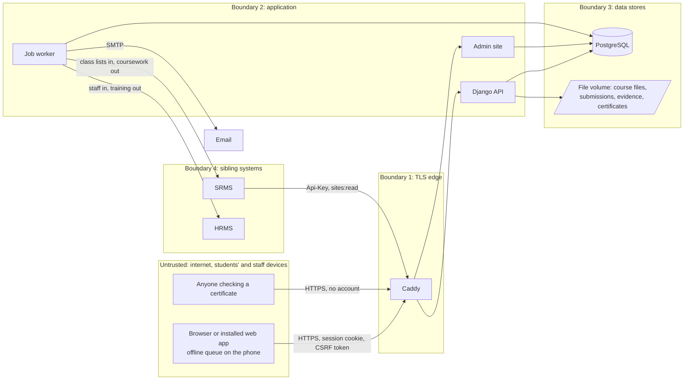

# Threat model

**Version 1.0, 6 October 2026,** checklist item 0.21. Method: STRIDE (spoofing, tampering, repudiation,
information disclosure, denial of service, elevation of privilege) over the data flows in section 3,
against the code on branch `feature/finish-operations` (base `dd12db6`). It follows the structure of the
HRMS threat model (`HRMS/gsa-hrms/docs/security/threat-model.md`, version 1.22), whose fixes the LMS
skeleton has ported (checklist Phase 1). The review against OWASP ASVS Level 2
([asvs-l2.md](asvs-l2.md), item 7.01) checks the same code requirement by requirement; this document says
what could go wrong and what stops it.

Reviewed at every release gate and whenever a data flow, role or integration is added. Gaps point to
items in the Gold Standard Implementation Checklist, or to a fix numbered in the ASVS review ("ASVS fix 3").

## 1. What is protected

| Asset | Examples | Classification | Where it lives and how |
|---|---|---|---|
| Learner records | Names, student numbers, email, campus, course memberships, from the SRMS | Personal; some learners are under 18 | PostgreSQL; read by the course's teaching staff and course administrators only (`courses/access.py`) |
| Submissions | Files and text students hand in, with the time and the late flag | Personal; decides progression | File volume under random names (`core/uploads.py`); each hand-in kept with a receipt and a SHA-256 of its contents (`assessments/models.py`) |
| Marks and feedback | Marks, rubric scores, comments, spoken feedback, released or not | Personal; become results in the SRMS | PostgreSQL and file volume; unreleased marks hidden from the student; locked once the SRMS accepts the total |
| Quiz attempts | Answers, marks, the events of each attempt; the question banks and right answers | Personal (attempts); integrity-critical (banks) | PostgreSQL; right answers never sent to a student during an attempt (`quizzes/schemas.py` `public_data`) |
| Practical evidence | Observations, logbook entries, photographs and scans, and a location when the person taps "Add my location" | Personal; photographs may show people and carry the phone's location inside the file | PostgreSQL and file volume (`practicals/`) |
| Accommodations and extensions | Extra time, extra days, another format, and why | Sensitive: the reason may describe a disability or illness (health data) | PostgreSQL; the reason seen only by course administrators, masked in the audit log (`assessments/arrangements_api.py`) |
| Attendance | Class sessions, the register, check-in times | Personal | PostgreSQL (`attendance/`) |
| Conversation | Forum posts and reports, private messages and read receipts | Personal; may involve minors | PostgreSQL (`forums/`, `messaging/`) |
| Certificates | Certificates of completion, their reference, check code and fingerprint, and the log of checks | Integrity-critical; personal | PDF on the file volume; check code encrypted (`certificates/models.py`) |
| Audit log | Who did what, when, from where, before and after | Integrity-critical | Insert-only table; a database trigger refuses UPDATE and DELETE; every entry chained to the one before by a keyed fingerprint, checked every night (`audit/chain.py`) |
| Credentials | Passwords, authenticator secrets, service keys, session cookies, password links, calendar feed addresses | Secret | PBKDF2-SHA256 with 1,000,000 iterations; authenticator secrets and feed tokens encrypted; service keys stored as SHA-256; password links signed over the password and the last sign-in, so each works once, for 7 days (invitation) or 60 minutes (reset) |
| Server secrets | `DJANGO_SECRET_KEY`, `FIELD_ENCRYPTION_KEY`, database and SMTP passwords, HRMS and SRMS keys | Secret | Environment only (git-ignored `.env`, platform variables) |
| Backups | Database dumps, copies of the file volume | As their content | Being built (item 7.09): encrypted with `age`, copy off site |

## 2. Who uses it, and who might attack it

| Actor | Access |
|---|---|
| Student | Their own courses (published sites only), their own work, released marks, their own attempts, forums and messages to teaching staff; often on a shared or borrowed phone over mobile data. Some are under 18 |
| Lecturer and teaching assistant | The sites they teach: content, assignments, every student's work and marks there, the register, practical observations; authenticator code required (`iam/services.py` `requires_mfa`, ADR 0013) |
| Course administrator | Every site; accommodations and their reasons; correction requests; term calendar; authenticator code required |
| Administrator | Everything, including the admin site, the retention schedule and the breach register; authenticator code required |
| Auditor | Read-only on every site and the audit log; no authenticator code today (read-only) |
| Data Protection Officer | The privacy notice, people's records for requests on paper, the breach register |
| SRMS and HRMS | Service keys with scope `sites:read` into the LMS; the LMS holds keys to their `academics:read`, `marks:write`, `staff:read`, `org:read`, `training:write` scopes |
| Someone with no account | The sign-in and password pages, and the public certificate check |
| Operators | Shell and database access on the host (Railway for staging now, GSA's chosen host later) |

Threat sources: an attacker on the internet; a student wanting a better mark or a friend's answers; a
current or former member of staff misusing access; a lost or shared phone; a compromised dependency; a
compromised sibling system.

## 3. Data flows and trust boundaries

Certificates are rendered inside the API by the PDF engine from escaped text only; the engine is given a
fetcher that refuses every address (`certificates/pdf.py` `_refuse`). Quiz questions imported from Moodle
XML, GIFT or QTI files are parsed inside the API with document types and entities refused
(`quizzes/formats.py` `refuse_unsafe_xml`).

There is no LTI tool, no outside AI service and no packaged-content (SCORM or H5P) player in the code.
ADR 0007 says that no learner data goes to an outside AI service without GSA's written approval after this
assessment covers it; ADR 0014 leaves the content players open. Each needs a new section here before it is
built.

## 4. Threats and controls

### Spoofing

| Threat | In place | Residual risk and gap |
|---|---|---|
| Guessing a password at sign-in | Lockout after 5 failures in 15 minutes per account; one address that fails 20 times in 15 minutes, across any accounts, waits out the window (`iam/services.py` `account_locked`, `address_blocked`; tests `iam/tests.py::test_account_locks_after_repeated_failures`, `::test_one_address_failing_across_many_accounts_is_held_back`); 12-character minimum and the common-password check | Low |
| Guessing the authenticator code once the password is known | Codes asked of administrators, course administrators and anyone teaching a site (`requires_mfa`); refused codes are audited | **High until fixed:** nothing limits the guesses except 600 requests a minute, and a code can be used twice within its 90 seconds (ASVS fix 1) |
| Enrolling one's own authenticator on someone else's account | The first code confirms the device; after that enrolment is refused (`mfa_enrol`) | Someone who has the password before the owner first signs in could enrol first; the invitation goes only to the owner's address, so they would first need the mailbox. Removing a device is done in the admin site and is not in the chained audit log (ASVS fix 2) |
| The admin site as a side door | No password form of its own; it accepts only a web sign-in that has passed the authenticator step (`iam/admin_site.py`; test `iam/tests.py::test_admin_needs_the_verified_web_sign_in`) | Low |
| Stolen session cookie | HttpOnly; Secure in production; SameSite Lax; HSTS for one year; a session ends after 30 minutes idle or 8 hours in all (`iam/middleware.py`); people see every device they are signed in on and can end any (`iam/views.py` `sessions_view`) | Low. Cookie names without the `__Host-` prefix (ASVS fix 11) |
| Shared phone in a lab or on the farm | Sign-out on every screen; 30-minute idle time-out; the offline queue sends a write only while its owner is signed in (`web/src/app/offlineQueue.ts`); the field copy of a class list is cleared on sign-out (`fieldCopy.ts`) | The field copy stays when the session times out rather than being signed out (ASVS fix 7); browsers may keep API answers (ASVS fix 3) |
| Taking over an account through "forgot password" | Same answer whether or not an account exists; the link goes only to the address on the account, works once, for 60 minutes; 5 requests per address and 3 links per account in 15 minutes; choosing a password ends every session (`forgot_password_view`, `set_password_view`) | No email tells the person that their password was changed (ASVS fix 10) |
| Redirecting the links | The sign-in email changes only when a link sent to the new address is followed within 48 hours; the old address is told (`iam/email_change.py`) | Someone holding both the password and the new mailbox can still change it; the notice to the old address is how the person finds out |
| Someone else checking in to a class (attendance) | The code in the room is an HMAC of the class and the time, valid for 60 seconds; the short code is valid for its minute and the next; one check-in per student per class; check-in open only from 15 minutes before to the end (`attendance/codes.py`, `attendance/api.py` `_check_in_open`) | **Medium:** a student in the room can send the code to a friend who is not, who has a minute to use it. The LMS does not ask for location (ADR 0008 keeps attendance light). The lecturer's register can correct a check-in; a lecturer who suspects it shows a fresh code and counts heads |
| Stolen service key | Hashed at rest, scoped, rotatable, last use recorded (`integration/models.py` `ServiceClient`); calls come over the private network | Rotation is not scheduled: record it in the runbook (item 7.11). The LMS sends its own key to whatever `next` address a sibling returns (ASVS fix 6) |
| Calendar feed address passed on | The address is a 256-bit secret, encrypted at rest; it shows due dates and classes only; a new one stops the old at once; 30 reads an hour per address and 120 per network address (`calendars/api.py`) | Anyone given the address reads that person's timetable until it is changed |

### Tampering

| Threat | In place | Residual risk and gap |
|---|---|---|
| Handing in or changing work after the due date | The server's clock decides lateness, never the phone's; late work is refused when the assignment does not allow it; work cannot be replaced after the due date, or at all once marked (`assessments/api.py` `submit`); each hand-in is kept with a receipt and a SHA-256 of its contents, sent to the student as a notice at once (`_send_receipt`) | Low. Being built in item 7.12: closed sites refuse every change except a course administrator's, for an appeal, audited (`terms/guard.py`) |
| A quiz answer saved after time is up | The deadline is the server's; an answer that arrives after it (plus a short grace) is refused and the attempt submitted (`quizzes/services.py` `save_answer`, `is_expired`); the attempt row is locked while an answer is written; test `quizzes/tests/test_api.py::test_time_limit_is_enforced_on_the_server` | Low. The phone's clock only orders two answers from the same device |
| A queued offline write replayed or altered | Each write carries an Idempotency-Key kept per account; the same key with a different body is refused; the phone's time is refused when more than 7 days old or 10 minutes ahead (`practicals/offline.py`); a write needs the owner's session and CSRF token | Low. Someone holding the phone and the owner's session could send a register entry with an earlier time within 7 days; the lecturer's register is the check |
| Changing a mark without trace | Every mark and release is audited in the same transaction; marks lock once the SRMS accepts the total (`assessments/models.py` `SrmsTransfer`) | Low |
| A forged or altered certificate | Each certificate has a reference, a random 12-character check code (60 bits, encrypted at rest) and the SHA-256 of the PDF as issued. Anyone can check it on a public page by reference and code; a wrong code and an unknown reference get the same answer; 10 wrong codes from one address or for one reference in 15 minutes stop checks; 30 checks a minute per address; the holder is told when it is checked; a withdrawn certificate says so (`certificates/checking.py`, `certificates/api.py` `check_page`) | Low. Anyone holding a copy can read its details on the page, which they could from the copy |
| Destroying records to hide something | Records are destroyed only under the retention schedule, in a run one person lists and a second approves; each destruction is audited with its rule (`privacy/retention.py`) | Low |
| Changing or removing audit entries | Insert-only with a trigger; every entry carries an HMAC-SHA256 of the one before and its own content, under a key derived from `FIELD_ENCRYPTION_KEY`, which is never in the database; checked every night and on request; a broken chain alerts administrators and the auditor (`audit/chain.py`; tests `audit/test_chain.py`) | Someone with the database and the server key could rewrite the chain: keep the key apart from the database and its backups (item 7.09). The application connects as the database superuser, which can switch the trigger off (ASVS fix 9) |
| Cross-site request forgery | Django CSRF protection on every session write; the web client sends the token (`web/src/api/client.ts`) | Low |
| Harmful uploads | Every upload is checked by its contents, not its name (PDF, photographs, Word, Excel or PowerPoint without macros, audio for feedback); limits of 50, 20 and 15 MB; Caddy refuses any request over 60 MB; random stored names; downloads are attachments with `nosniff`, never a public address (`core/uploads.py`; tests `core/test_uploads.py`) | **Medium:** no virus scan (ASVS fix 15). A PDF or Office file that is malicious but well formed reaches the lecturer's computer |
| Script in rich pages, forum posts, messages or quiz text | Cleaned on the server against an allow-list with nh3: no script, no event handlers, links to web and email addresses only, images only from the LMS (`courses/richtext.py` `clean`); maths drawn by KaTeX with `trust: false`; a Content-Security-Policy that allows only the app's own scripts, checked on every browser journey (`deploy/Caddyfile.prod`; `web/e2e/support.ts`) | Low. A message waiting to send is shown before cleaning, in its author's own browser (ASVS fix 8) |
| Hostile quiz import files | Document types and entities refused before parsing; 5 MB per file, a limit on files and unpacked size in a package (`quizzes/formats.py`) | Low |
| Tampered dependencies | Python packages locked with hashes; npm lockfile; CI actions pinned to commits; licence, vulnerability and secret gates (`.github/workflows/ci.yml`) | Base images follow tags (ASVS fix 25); bill of materials being built (item 7.20) |
| Coursework sent to the SRMS changed on the way | Sent with the LMS's scoped key; the SRMS accepts it only on a draft result | Plain HTTP on the private network until hosting decides otherwise (item 7.04) |

### Repudiation

| Threat | In place | Residual risk and gap |
|---|---|---|
| A student says they handed work in on time | The receipt code, the server time and the content fingerprint, sent to the student as a notice at once and kept for good (`assessments/marking_api.py` receipt look-up) | Low |
| A lecturer denies a mark, a release or a change of content | Audit rows with actor, time, address, before and after, read in words by the auditor (`audit/views.py`) | Low |
| An administrator denies giving a role | Roles are given in the Django admin site | **Gap:** not in the chained audit log, no reason recorded (ASVS fix 2) |
| A student denies a forum post or message | Every post and message is audited; edits only within 30 minutes; removals by moderators with a reason (`forums/api.py`) | Low |
| Forging the address recorded in the audit log | Caddy sets `X-Real-IP` to the address it saw and only that is recorded (`core/net.py`; test `iam/tests.py::test_a_forged_forwarded_for_header_does_not_reach_the_records`) | The privacy notice acknowledgement still reads `X-Forwarded-For` (ASVS fix 5) |
| Failed sign-ins and lockouts not on record | Kept in `LoginAttempt` | Removed after 12 months and not in the chained log (ASVS fix 23); production clock to be synchronised (item 7.11) |

### Information disclosure

| Threat | In place | Residual risk and gap |
|---|---|---|
| A student sees another's work or marks | Students see their own submissions and released marks only (`visible_submissions`; `site_gradebook` with `released_only`); an id from another site reads as unknown (`TaughtRecord`); tests `courses/test_scope.py` | Low |
| Quiz answers leak before or during an attempt | During an attempt a student receives questions without right answers (`schemas.public_data`); right answers, marks and feedback reach them only when the quiz's review options and the release allow (test `quizzes/tests/test_api.py::test_review_options_never_and_marks_hidden`); banks and statistics for teaching staff only; unpublished quizzes hidden; questions and answer order can be shuffled per attempt with a secure generator | **Medium:** students sitting the same quiz can share answers outside the system; ADR 0006 relies on question pools, shuffling and time limits rather than surveillance. Attempt events show unusual timing to the lecturer |
| Forum or Q&A answers seen too early | In a question-and-answer forum a student sees others' replies only after replying (`forums/api.py`) | Low |
| Under-18 learners exposed to other people | No public profiles, no leaderboards; forums are within a course; students cannot message other students unless `MESSAGING_STUDENT_TO_STUDENT` is switched on (off by default); a conduct statement is accepted before posting; posts can be reported and removed | The LMS holds no date of birth, so it cannot tell who is under 18 (impact assessment, section 4) |
| Location in practical photographs | The location field is filled only when the person taps "Add my location" (`practicals/FieldWidgets.tsx`) | **Medium:** photographs keep the location the phone wrote into the file, which goes to whoever downloads them. Remove image metadata on upload (new action, section 5) |
| An accommodation's reason seen by the wrong person | Teaching staff learn only that an accommodation applies, never why; the reason is masked in the audit log | Stored unencrypted; an extension's reason is copied into the audit log (ASVS fix 4) |
| Browsers keeping API answers | | API answers carry no `Cache-Control: no-store` (ASVS fix 3) |
| Script injection stealing data | See Tampering; plus `X-Frame-Options: DENY`, `Referrer-Policy`, API documentation for signed-in people only (`iam/permissions.py` `DocsPermission`) | The development server runs without the policy |
| Real data on staging abroad | Staging holds fictional data only; `seed_demo` and `seed_journeys` refuse to run without `--fictional` | Production hosting in Guyana (item 7.04) |
| Data in backups | | Being built (item 7.09); destroyed records stay in backups until those expire |
| Error details | `DEBUG` off in production; `check --deploy` must pass in CI; refusals carry a code and a sentence only (`core/exceptions.py`) | A crash shows Django's plain 500 page with no reference (ASVS fix 12) |
| Personal details in email | Notices name the course and what happened | Email should carry a link, not names and marks, until GSA's mail service is known to be in Guyana (impact assessment, section 3) |
| A spreadsheet export that runs formulas | The gradebook and audit exports prefix any cell a spreadsheet would run (`assessments/gradebook_api.py` `_cell`, `audit/views.py` `_cell`) | Low |
| A breach going unrecorded | A breach register that alerts the administrators and the DPO, and records whether minors were affected (`privacy/models.py` `Breach`) | Write the breach procedure into the runbook (item 7.11); GSA to name the DPO |

### Denial of service

| Threat | In place | Residual risk and gap |
|---|---|---|
| Flooding the API | 600 requests a minute per person or address; four gunicorn workers behind Caddy | The limit is counted in each worker's memory, not shared. Load test with a whole class sitting one quiz (item 7.08) |
| Filling the disk | 60 MB request cap; per-kind limits; a storage allowance per site (`courses/storage.py`) | No allowance per student (ASVS fix 26); disk-space alerts being built (item 7.10) |
| Zip or XML bombs | Limits on members and unpacked size; entities refused | Low |
| Guessing certificate codes or feed addresses | Per-address and per-reference limits | Low |

### Elevation of privilege

| Threat | In place | Residual risk and gap |
|---|---|---|
| A student acting as teaching staff | Access decided by site membership in one place (`courses/access.py` `site_role`, `can_teach`); a site a person can open but not teach is refused before the fields are read (test `courses/test_scope.py::test_a_site_one_can_open_but_not_teach_is_refused_before_the_fields_are_read`); a permission-table test is being added (`config/test_permission_table.py`) | Each new endpoint must join that test |
| A lecturer on another campus's site | Writes check the site in the field and the view (test `courses/test_scope.py::test_a_lecturer_cannot_build_on_a_site_of_another_campus`) | Low |
| A new role used without its second factor | A session counts as verified only after a code; giving or taking a role signs the person out everywhere (`iam/sessions.py` `roles_changed`; test `iam/test_sessions.py::test_a_role_given_or_taken_away_signs_the_person_out_everywhere`) | Low |
| Giving oneself, or others, more access | Roles are given in the admin site, which needs a verified sign-in; the access review each term lists every role and every teaching membership (`iam/review.py`) | **Gap:** no rule on who may give which role and no audit entry (ASVS fix 2) |
| A leaver or a student who drops out keeping access | A person made inactive by the SRMS or HRMS sync has their account closed at once and every session ended (`people/signals.py`, `iam/accounts.py` `close_account`) | Low |
| A sibling system reading more than it should | The `sites:read` scope only; the integration endpoint carries no identifiers beyond codes (`integration/api.py`) | Low |

## 5. Actions remaining

| Action | Kind | Where |
|---|---|---|
| Limit and record refused authenticator codes; refuse a code used twice | Code change | ASVS fix 1 (`iam/views.py`, `iam/models.py`) |
| Audit roles given and taken, and authenticator resets, with a reason; decide who may give which role | Code change | ASVS fix 2 (`iam/admin.py`) |
| `Cache-Control: no-store` on API answers | Code change | ASVS fix 3 |
| Encrypt an accommodation's reason; keep extension reasons out of the audit log | Code change | ASVS fix 4 |
| Record the real address of a notice acknowledgement | Code change | ASVS fix 5 (`privacy/views.py`) |
| Follow a sibling's `next` address only on the same host | Code change | ASVS fix 6 (`integration/client.py`) |
| Clear the field copy when a session times out | Code change | ASVS fix 7 (`web/src/App.tsx`) |
| Show a waiting message as plain text | Code change | ASVS fix 8 |
| Connect the application to PostgreSQL as a role that cannot alter the audit table | Configuration change | ASVS fix 9 |
| Remove location and other metadata from photographs on upload (practical evidence, course images) | Code change (new) | `practicals/uploads.py`, `core/uploads.py`; needs an image library within the licence policy (Pillow, MIT-CMU) |
| Scan uploads for viruses | Code and configuration change | ASVS fix 15 |
| Retention rules for messages, attempts, attendance, evidence and certificate checks | Code change, periods for GSA | ASVS fix 13; impact assessment, section 7 |
| Encrypted backups kept apart from the key; restore drill | Being built | Item 7.09 |
| Monitoring, alerts and structured logs | Being built | Item 7.10 |
| Closed sites read-only after term | Being built | Item 7.12 |
| Software bill of materials | Being built | Item 7.20 |
| Rotation of service keys and the breach procedure in the runbook | Documentation | Item 7.11 |
| Production hosting in Guyana; TLS inside the host if the network is shared | Hosting | Item 7.04 |
| Independent penetration test | GSA | Item 7.02 |

## 6. Next review

At Gate 1 and before any real learner record is loaded. Owner: the Technical Lead, with GSA's IT Officer and
Data Protection Officer.
